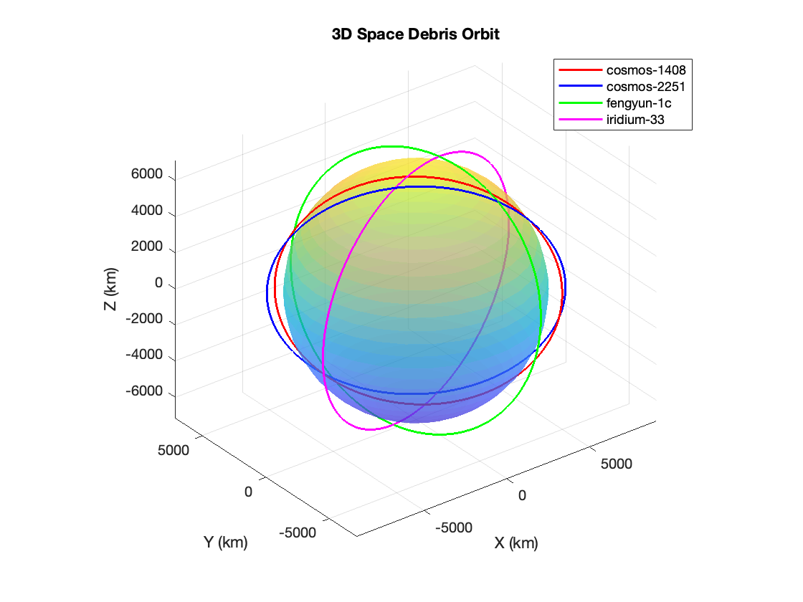

# Space_Debris
A small project to simulate trajectories of space debris. 

# Space Debris Tracking

This MATLAB script reads and processes Two-Line Element (TLE) data for space debris objects. It extracts orbital parameters and visualizes their trajectories in a 3D plot.

## Features
- Reads TLE data for multiple debris objects.
- Extracts key orbital elements (inclination, RAAN, eccentricity, etc.).
- Converts orbital elements to Cartesian coordinates.
- Plots 3D orbits with Earth as a reference.

## 3D Orbit Visualization
Below is a sample output of the MATLAB script:

## 3D Animated Orbit 

## How to Use
1. Run `Space_debris_step1.m` in MATLAB.
2. Ensure TLE files are in the same directory.
3. The script will generate a 3D plot and save it as `debris_trajectory.png`.

## To-Do
- Implement real-time tracking.
- Improve visualization with better Earth rendering.
- Add security features for TLE data integrity.

